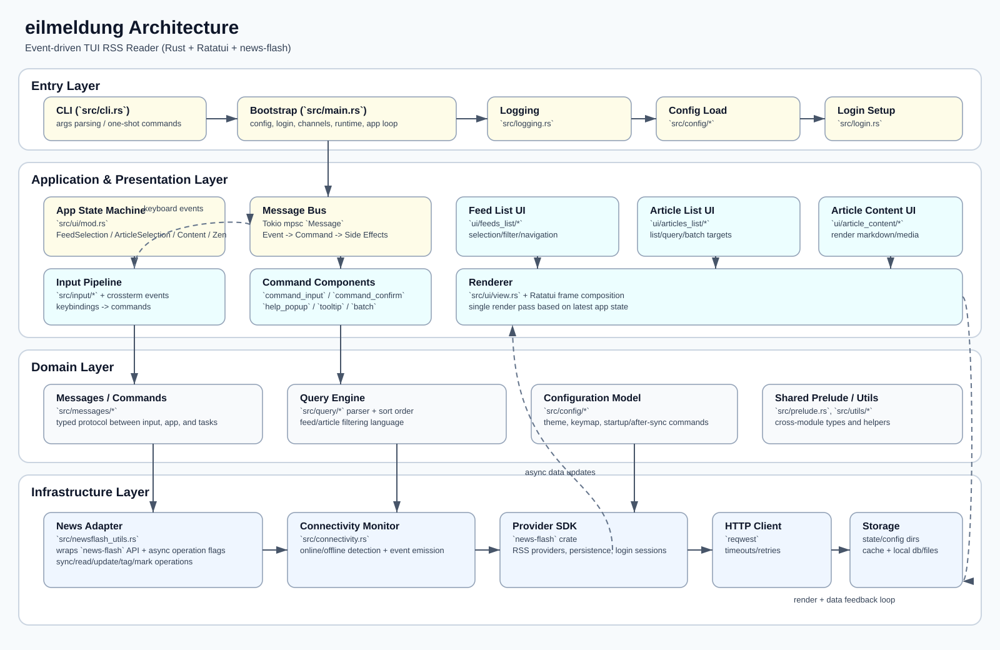

# eilmeldung


一个基于 Rust + Ratatui + news-flash 的高性能 TUI RSS 阅读器。

- 非阻塞终端 UI，偏 Vim 的键位体验
- 支持多 RSS Provider（依赖 `news-flash`）
- 查询语言（过滤/搜索/批处理）
- 强配置能力（主题、键位、面板内容、自动命令）

## 架构总览



应用采用“事件驱动 + 分层模块”设计：输入事件进入消息总线，业务命令分发到 UI 子模块和新闻数据层，再统一渲染回终端。

## 项目结构

```text
.
├── src/
│   ├── main.rs                 # 启动入口：初始化、登录、任务、主循环
│   ├── cli.rs                  # CLI 参数与命令执行
│   ├── connectivity.rs         # 网络连通性监听
│   ├── logging.rs              # 日志初始化
│   ├── login.rs                # 首次登录与引导
│   ├── newsflash_utils.rs      # news-flash 封装（数据访问/异步操作）
│   ├── config/                 # 配置模型、主题、路径、键位等
│   ├── input/                  # 键盘输入解析
│   ├── messages/               # 事件/命令消息定义与解析
│   ├── query/                  # 查询语言解析与排序
│   └── ui/                     # UI 组件与页面状态机
├── docs/                       # 用户文档（安装、命令、配置、FAQ）
├── examples/                   # 默认配置与主题示例
├── assets/                     # 静态资源
└── .github/workflows/          # CI：fmt/clippy/test/release
```

## 快速开始

1. 安装 Rust（建议 stable）
2. 克隆仓库并运行：

```bash
cargo run
```

3. 首次启动按引导完成 Provider 登录与同步

常用命令：

```bash
cargo build
cargo build --release
cargo test --all-features
cargo fmt --check
cargo clippy --all-targets --all-features -- -D warnings
```

## 运行流程（从启动到渲染）

1. `main.rs` 解析 CLI、加载配置、初始化日志与错误处理。
2. 构建 `NewsFlash` 与 HTTP client，必要时执行登录/重登。
3. 创建 Tokio MPSC 消息通道与 `ConnectivityMonitor`。
4. 初始化 `App`（包含 feed/article/content 等 UI 子模块）。
5. 启动输入读取线程，将键盘事件转换为 `Message`。
6. 进入主循环：`Message -> Command/Event -> 状态变更 -> Ratatui 渲染`。

## 模块化拆分（现状与建议）

### 现状分层

- `app` 层：`main.rs`, `ui/mod.rs`（应用生命周期与状态机）
- `domain` 层：`query/`, `messages/`, `config/`（规则、命令、配置模型）
- `infra` 层：`newsflash_utils.rs`, `connectivity.rs`, `login.rs`（外部系统交互）
- `presentation` 层：`ui/*/view.rs`, `ui/*/model.rs`（终端展示）

### 建议重构为 workspace（可渐进）

```text
crates/
├── eilmeldung-app        # 启动、DI、生命周期
├── eilmeldung-domain     # query/messages/config 抽象与模型
├── eilmeldung-feed       # news-flash 适配器与同步策略
├── eilmeldung-ui         # ratatui 组件与页面编排
└── eilmeldung-cli        # CLI 命令和自动化任务
```

重构顺序建议：
1. 先抽离 `domain`（低耦合、收益最高）。
2. 再抽离 `feed` 适配层（隔离第三方依赖）。
3. 最后拆 `ui`（避免一次性改动过大）。

## Rust 新手学习路径（7 天）

目标：一周内搞清楚这个项目的主干，并能独立做一个小功能改动。

### Day 1：跑通与观察
- 运行：`cargo run`
- 阅读：`src/main.rs`
- 任务：画出你自己的启动流程（配置加载、登录、消息通道、主循环）。

### Day 2：消息驱动模型
- 阅读：`src/messages/mod.rs`, `src/messages/event.rs`, `src/messages/command/*`
- 任务：梳理一次按键触发后的链路：`Input -> Message -> Command -> UI 更新`。

### Day 3：输入与键位映射
- 阅读：`src/input/mod.rs`, `src/input/key.rs`, `src/config/input_config.rs`
- 任务：新增或修改一个键位绑定，验证行为变化。

### Day 4：UI 状态机与渲染
- 阅读：`src/ui/mod.rs`, `src/ui/view.rs`, `src/ui/*/model.rs`, `src/ui/*/view.rs`
- 任务：给列表增加一个小显示字段，或调整一个面板文案。

### Day 5：配置系统
- 阅读：`src/config/mod.rs` 与子模块、`examples/default-config.toml`
- 任务：新增一个布尔配置项并接入一个 UI 行为开关。

### Day 6：查询语言与测试
- 阅读：`src/query/parse.rs`, `src/query/sort_order.rs`
- 任务：增加一个查询语法边界测试（优先在现有测试模块中补）。

### Day 7：数据层与一次完整提交
- 阅读：`src/newsflash_utils.rs`, `src/connectivity.rs`, `src/login.rs`
- 任务：完成一个小功能 PR，提交前执行：

```bash
cargo fmt --check
cargo clippy --all-targets --all-features -- -D warnings
cargo test --all-features
```

建议每次只改一个点，保持“小步提交 + 可回滚”。

## 配置与文档

- 默认配置示例：`examples/default-config.toml`
- 主题示例：`examples/light-ansi-palette.toml`
- 详细文档：`docs/getting-started.md`, `docs/configuration.md`, `docs/commands.md`, `docs/queries.md`

## 测试与质量门禁

- 单元测试贴近模块实现（如 `src/query/`, `src/config/`）
- CI 默认执行：`fmt` + `clippy` + `cargo test --all-features`
- 提交前建议本地完整跑一次质量命令，确保与 CI 一致

## 贡献建议

- Commit 使用简洁祈使句，必要时加 `chore:` / `feat:` / `fix:` 前缀
- PR 至少包含：变更动机、核心改动、测试结果
- 涉及 UI 行为的改动请附截图或短录屏

## License

GPL-3.0-or-later
